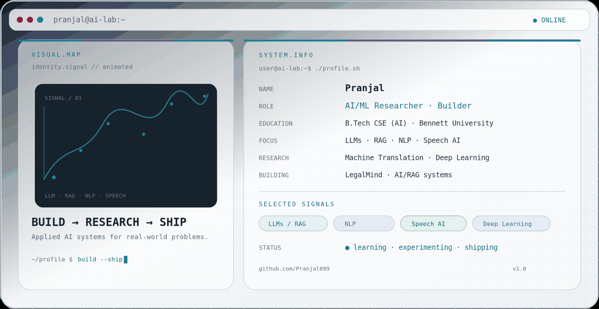
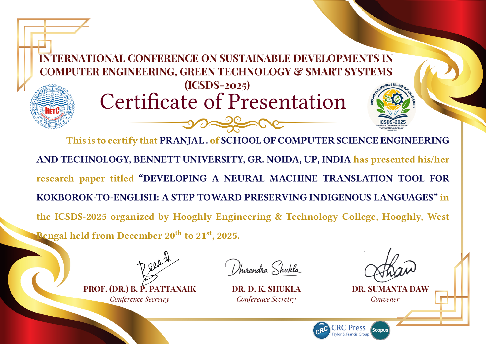
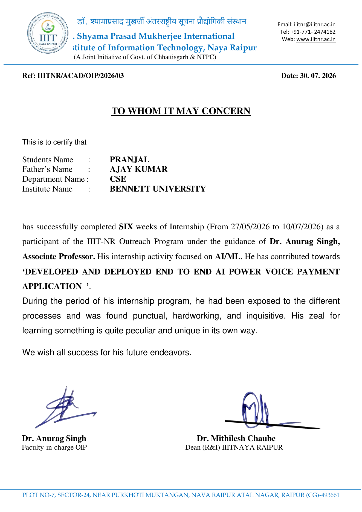

<picture>
  <source media="(prefers-color-scheme: dark)" srcset="assets/banner-dark.gif">
  <source media="(prefers-color-scheme: light)" srcset="assets/banner-light.gif">
  
</picture>

  <a href="#about">About</a> ·
  <a href="#research">Research</a> ·
  <a href="#projects">Projects</a> ·
  <a href="#experience">Experience</a> ·
  <a href="#publications">Publication</a> ·
  <a href="#credentials">Credentials</a> ·
  <a href="#activity">Activity</a> ·
  <a href="#contact">Contact</a>

##  About

### AI/ML Researcher · Builder

I work across **language, speech, explainability, and secure AI** — from model development and evaluation to deployed APIs, mobile applications, and research prototypes.

**B.Tech Computer Science & Engineering (AI)** · Bennett University · 2024–2028 · **CGPA 8.8**

<table>
<tr>

<td align="center" valign="top" width="25%">
 
<strong>LANGUAGE</strong> 
NLP · LLMs · RAG · NMT
</td>

<td align="center" valign="top" width="25%">
 
<strong>SPEECH</strong> 
ASV · ASR · Anti-Spoofing
</td>

<td align="center" valign="top" width="25%">
 
<strong>TRUST</strong> 
XAI · Security · Evaluation
</td>

<td align="center" valign="top" width="25%">
 
<strong>DEPLOYMENT</strong> 
FastAPI · Flutter · APIs
</td>

</tr>
</table>

##  Research

<table>
<tr>

<td valign="top" width="50%">

### Language & Foundation Models

**Machine Translation** — Low-resource Kokborok → English NMT using Meta M2M100.

**LLMs / RAG** — Retrieval-augmented and language-model based AI systems.

</td>

<td valign="top" width="50%">

### Speech & Biometrics

**Speaker Verification** — ECAPA-TDNN based voice authentication.

**Speech Recognition** — Whisper-based speech-to-text and intent extraction.

</td>

</tr>
<tr>

<td valign="top" width="50%">

### Explainable & Trustworthy AI

**Explainable AI** — Feature-level explanations and model interpretation.

**Security** — AI systems for secure authentication and cyber-threat detection.

</td>

<td valign="top" width="50%">

### Financial ML

**Option Pricing** — Deep residual correction of Black–Scholes European option prices using sequence models.

</td>

</tr>
</table>

  Fine-tuning · NMT · Speaker Verification · ASR · Anti-Spoofing · XAI · Evaluation · Data Preprocessing
   
  <strong>RESEARCH → EXPERIMENT → EVALUATE → DEPLOY</strong>

##  Selected Work

<table>
<tr>

<td valign="top" width="50%">

### 01 · Kokborok → English NMT

Low-resource neural machine translation for Kokborok → English.

**BLEU 70.56** · **METEOR 0.76** · **ROUGE-L 0.80**

38K sentence pairs · M2M100-418M · PyTorch · Transformers

Published in 2026 — CRC Press / Taylor & Francis

</td>

<td valign="top" width="50%">

### 02 · VoicePay

End-to-end voice payment research prototype combining speaker verification, anti-spoofing, ASR, payment intent extraction, and mobile deployment.

**EER 5.88% → 3.52%**

186 speakers · 9,660 training · 1,074 validation · 5,000 genuine/impostor trials

ECAPA-TDNN · AASIST · Whisper · Flutter · FastAPI · SQLite

</td>

</tr>
<tr>

<td valign="top">

<a href="https://github.com/Pranjal099/kokborok-english-neural-machine-translation"><strong>Repository</strong></a> ·
<a href="https://doi.org/10.1201/9781003743767-121"><strong>DOI</strong></a> ·
<a href="https://scholar.google.com/citations?user=k59ikhAAAAAJ&amp;hl=en"><strong>Scholar</strong></a>

</td>

<td valign="top">

<a href="https://github.com/Pranjal099/Voicepay"><strong>Mobile</strong></a> ·
<a href="https://github.com/Pranjal099/voice-auth-api"><strong>Backend</strong></a> ·
<a href="https://github.com/Pranjal099/Voicepay/releases/tag/v1.0.0"><strong>Release</strong></a> ·
<a href="https://huggingface.co/spaces/Pranjal99/voicepay-HF"><strong>Live</strong></a>

</td>

</tr>
<tr>

<td valign="top" width="50%">

### 03 · Deep Residual Option Pricing

**Deep Residual Correction of Black–Scholes European Option Prices Using an LSTM-Transformer Network**

Learning residual corrections to Black–Scholes European option prices using deep sequence models.

**Research paper in preparation**

Collaboration involving researchers associated with IIT Patna, IIM Ahmedabad, and Bennett University.

</td>

<td valign="top" width="50%">

### 04 · SOAR-X

**Security Orchestration, Automation & Response using Explainable AI**

**9M+ network records**

Random Forest classification · SHAP feature-level explanations · Risk scores · Severity levels

FastAPI inference · Vercel deployment

*Personal contribution: data processing, ML pipeline, model training/optimization, explainability, and security insight generation.*

</td>

</tr>
<tr>

<td valign="top">

Paper in preparation

</td>

<td valign="top">

<a href="https://github.com/Pranjal099/SoarX"><strong>Repository</strong></a>

</td>

</tr>
</table>

##  Experience

<table>
<tr>

<td valign="top" width="50%">

### Research Intern

**Biomedical and Speech Processing Lab · IIIT Naya Raipur**

27 May – 10 July 2026 · 6 weeks

End-to-end AI-powered voice payment application developed through the IIIT-NR Outreach Program.

ECAPA-TDNN · AASIST · Whisper · Flutter · FastAPI · SQLite

**Mentors:** Dr. Anurag Singh · Er. Om Nath Singh

</td>

<td valign="top" width="50%">

### Research Collaboration

**Option Pricing Research · IIT Patna · IIM Ahmedabad · Bennett University**

Deep residual correction of Black–Scholes European option prices using an LSTM-Transformer network.

Research paper in preparation

</td>

</tr>
</table>

##  Publication

<table>
<tr>
<td valign="top">

### Developing a Neural Machine Translation Tool for Kokborok-to-English: A Step Toward Preserving Indigenous Languages

**Sanchali Das · Pranjal Gautam · Mainak Sarkar**

Published in 2026 — **CRC Press / Taylor & Francis**

Research on low-resource Kokborok-to-English neural machine translation using Meta's M2M100 multilingual model.

<a href="https://doi.org/10.1201/9781003743767-121"><strong>DOI</strong></a> ·
<a href="https://scholar.google.com/citations?user=k59ikhAAAAAJ&amp;hl=en"><strong>Google Scholar</strong></a> ·
<a href="https://github.com/Pranjal099/kokborok-english-neural-machine-translation"><strong>Repository</strong></a>

</td>
</tr>
</table>

##  Credentials

<table>
<tr>

<td valign="top" width="50%">

### Research Paper Presentation

**ICSDS-2025** · 20–21 December 2025

Presented: *Developing a Neural Machine Translation Tool for Kokborok-to-English: A Step Toward Preserving Indigenous Languages*

</td>

<td valign="top" width="50%">

### Research Internship

**IIIT Naya Raipur** · 27 May – 10 July 2026

Six-week AI/ML research internship through the IIIT-NR Outreach Program.

</td>

</tr>
<tr>

<td valign="middle" align="center">

</td>

<td valign="middle" align="center">

</td>

</tr>
<tr>

<td align="center">

<a href="./assets/credentials/icsds-2025-presentation-certificate.pdf"><strong>VIEW CERTIFICATE ↗</strong></a>

</td>

<td align="center">

<a href="./assets/credentials/iiitnr-internship-certificate.pdf"><strong>VIEW CERTIFICATE ↗</strong></a>

</td>

</tr>
</table>

##  GitHub Activity

  <picture>
    <source media="(prefers-color-scheme: dark)" srcset="https://raw.githubusercontent.com/Pranjal099/Pranjal099/output/github-snake-dark.svg">
    <source media="(prefers-color-scheme: light)" srcset="https://raw.githubusercontent.com/Pranjal099/Pranjal099/output/github-snake.svg">
    
  </picture>

## GitHub Activity

  

##  Contact

  <strong>Let's build something useful.</strong>
   
  Research collaborations across NLP · Speech AI · Explainable AI · Secure AI

  <a href="https://www.linkedin.com/in/pranjal99/"><strong>LINKEDIN</strong></a> &nbsp;·&nbsp;
  <a href="https://scholar.google.com/citations?user=k59ikhAAAAAJ&amp;hl=en"><strong>GOOGLE SCHOLAR</strong></a> &nbsp;·&nbsp;
  <a href="mailto:pranjalofficial32@gmail.com"><strong>EMAIL</strong></a>

  
   
  <strong>Published · Ongoing · Deployed</strong>

