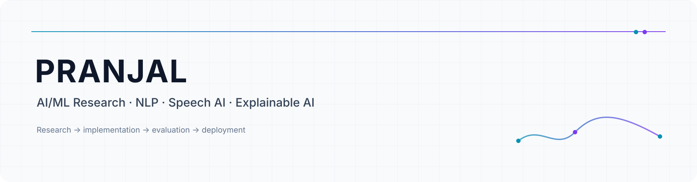

<picture>
  <source media="(prefers-color-scheme: dark)" srcset="assets/banner-dark.svg">
  <source media="(prefers-color-scheme: light)" srcset="assets/banner-light.svg">
  
</picture>

  <a href="#about">About</a> ·
  <a href="#research">Research</a> ·
  <a href="#projects">Projects</a> ·
  <a href="#experience">Experience</a> ·
  <a href="#publications">Publications</a> ·
  <a href="#credentials">Credentials</a> ·
  <a href="#contact">Contact</a>

## About

I am an AI/ML researcher and engineer working across language, speech, explainability, and secure AI. My work combines model development and evaluation with end-to-end implementation, including deployed APIs, mobile applications, and research prototypes.

**B.Tech Computer Science & Engineering (AI)** · Bennett University · 2024–2028 · **CGPA 8.8**

### Research focus

Building and evaluating AI systems across **NLP, LLMs/RAG, speech AI, and trustworthy AI**, with an emphasis on measurable model performance and practical deployment.

**Language & Foundation Models** — NLP · LLMs/RAG · Machine Translation  
**Speech & Biometrics** — Speech AI · Speaker Verification · ASR  
**Trustworthy AI** — Explainable AI · Secure AI · Cybersecurity

## Research

**Machine Translation** — Low-resource Kokborok → English NMT using Meta M2M100  
**Speech AI** — Speaker verification, anti-spoofing, ASR, voice-based authentication  
**Explainable AI** — Feature-level model explanations and security risk interpretation  
**Financial ML** — Deep residual correction of Black–Scholes option prices  
**Secure AI** — Voice payment authentication and cyber-threat detection

**Research methods:** Fine-tuning · Neural machine translation · Speaker verification · ASR · Anti-spoofing · Explainable AI · Model evaluation · Data preprocessing

## Featured projects

### 01 — Kokborok → English Neural Machine Translation

A low-resource neural machine translation system developed for Kokborok → English translation.

- ~**38,000** sentence pairs
- **M2M100-418M** fine-tuned with PyTorch and Hugging Face Transformers
- Test set: **100 Kokborok sentences**
- **BLEU 70.56 · METEOR 0.76 · ROUGE-L 0.80**
- End-to-end contribution: corpus construction, cleaning, preprocessing, model implementation, fine-tuning, evaluation, error analysis, code, and paper writing
- **Published in 2026 — CRC Press / Taylor & Francis**

**[Repository](https://github.com/Pranjal099/kokborok-english-neural-machine-translation) · [DOI](https://doi.org/10.1201/9781003743767-121) · [Google Scholar](https://scholar.google.com/citations?user=k59ikhAAAAAJ&hl=en)**

---

### 02 — VoicePay

An end-to-end voice payment research prototype combining speaker verification, anti-spoofing, speech recognition, payment intent extraction, and mobile deployment.

- **ECAPA-TDNN** speaker verification
- **AASIST** anti-spoofing
- **Whisper** speech recognition
- **Flutter** + **FastAPI** + **SQLite**
- Authentication, enrollment, payment confirmation, QR payment, and end-to-end integration
- **186 speakers · 9,660 training utterances · 1,074 validation utterances**
- Fixed evaluation protocol: **5,000 genuine/impostor trials**
- Pretrained ECAPA baseline **EER 5.88%** → fine-tuned ECAPA **EER 3.52%**
- Completed research prototype + deployed

**[Mobile Repository](https://github.com/Pranjal099/Voicepay) · [Backend Repository](https://github.com/Pranjal099/voice-auth-api) · [Release](https://github.com/Pranjal099/Voicepay/releases/tag/v1.0.0) · [Deployment](https://huggingface.co/spaces/Pranjal99/voicepay-HF)**

---

### 03 — Deep Residual Correction of Black–Scholes European Option Prices Using an LSTM-Transformer Network

Research on learning residual corrections to Black–Scholes European option prices using deep sequence models.

- AI-based option pricing research comparing learned corrections with the Black–Scholes framework
- Research paper **in preparation**
- Collaboration involving researchers associated with **IIT Patna, IIM Ahmedabad, and Bennett University**

**Repository:** to be added when confirmed

---

### 04 — SOAR-X

**Security Orchestration, Automation & Response using Explainable AI** for cyber-threat detection.

- **9M+ network records**
- Random Forest benign/malicious classification
- Feature selection using model importance
- **SHAP** explanations for individual predictions
- Risk scores and severity levels
- **FastAPI** inference backend
- Frontend deployed on **Vercel**
- Personal contribution: data processing, ML pipeline, model training/optimization, explainability, and security insight generation
- **Live / deployed**

**[Repository](https://github.com/Pranjal099/SoarX)**

## Experience

### Research Intern — Biomedical and Speech Processing Lab

**IIIT Naya Raipur · 27 May – 10 July 2026**

Six-week research internship focused on an end-to-end AI-powered voice payment application.

**ECAPA-TDNN · AASIST · Whisper · Flutter · FastAPI · SQLite · End-to-end deployment**

**Mentors:** Dr. Anurag Singh · Er. Om Nath Singh

### Research collaborations

**Option Pricing Research** — collaboration involving IIT Patna, IIM Ahmedabad, and Bennett University.

## Publications

### Developing a Neural Machine Translation Tool for Kokborok-to-English: A Step Toward Preserving Indigenous Languages

**Sanchali Das · Pranjal Gautam · Mainak Sarkar**

**Published in 2026 — CRC Press / Taylor & Francis**

Research on low-resource Kokborok-to-English neural machine translation using Meta's M2M100 multilingual model.

**[DOI](https://doi.org/10.1201/9781003743767-121) · [Google Scholar](https://scholar.google.com/citations?user=k59ikhAAAAAJ&hl=en) · [Repository](https://github.com/Pranjal099/kokborok-english-neural-machine-translation)**

## Credentials

### Research Paper Presentation

**ICSDS-2025 · 20–21 December 2025**

Presented the research paper:

*Developing a Neural Machine Translation Tool for Kokborok-to-English: A Step Toward Preserving Indigenous Languages*

 

<a href="./assets/credentials/icsds-2025-presentation-certificate.pdf">
View certificate
</a>

  

### Research Internship

**IIIT Naya Raipur · 27 May – 10 July 2026**

Six-week AI/ML research internship through the IIIT-NR Outreach Program.

 

<a href="./assets/credentials/iiitnr-internship-certificate.pdf">
View certificate
</a>

## Contact

Interested in research collaborations across **NLP, Speech AI, Explainable AI, and Secure AI**.

**[LinkedIn](https://www.linkedin.com/in/pranjal99/) · [Google Scholar](https://scholar.google.com/citations?user=k59ikhAAAAAJ&hl=en) · [Personal Email](mailto:pranjalofficial32@gmail.com)**

---

Published, ongoing, and deployed work are labeled separately.
