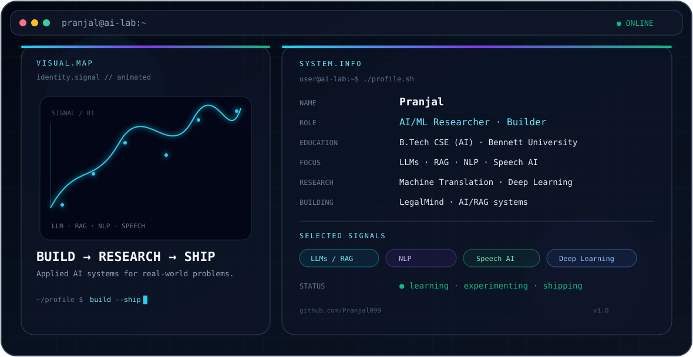

<picture>
<source media="(prefers-color-scheme: dark)" srcset="./dark.svg">
<source media="(prefers-color-scheme: light)" srcset="./light.svg">

</picture>

# 👋 Hi, I'm Pranjal

**AI/ML Researcher · LLMs & NLP · Speech AI · Deep Learning**

I am a Computer Science and Engineering student specializing in Artificial Intelligence at **Bennett University**, focused on building intelligent systems that solve real-world problems.

My technical interests include **Large Language Models, Retrieval-Augmented Generation, Natural Language Processing, Speech AI, Deep Learning, and applied AI research**.

---

## 🔬 Research & Technical Interests

- Large Language Models (LLMs) and Retrieval-Augmented Generation
- Natural Language Processing and Machine Translation
- Speech AI, Speaker Verification, and Anti-Spoofing
- Deep Learning and Explainable AI
- Computer Vision and AI for Healthcare
- Applied AI research and real-world AI systems

---

## 🚀 Featured Projects

### 🎙️ VoicePay — AI-Powered Voice Payment Authentication
AI-powered voice payment system integrating speaker verification, ASR, anti-spoofing, intent understanding, FastAPI, and a mobile application.

`ECAPA-TDNN` `AASIST` `Whisper` `RapidFuzz` `FastAPI` `Flutter`

### 🛡️ SOAR-X — Explainable AI for Cybersecurity
Explainable AI system focused on phishing detection, machine-learning classification, and model interpretation.

`Python` `Random Forest` `SHAP` `FastAPI` `Streamlit`

### 🌐 Kokborok → English Neural Machine Translation
Transformer-based neural machine translation work focused on a low-resource indigenous language and digital language preservation.

`M2M100` `Hugging Face Transformers` `NLP` `Machine Translation`

📚 Published chapter: **CRC Press / Taylor & Francis**

### 📈 AI-Based Option Pricing
Deep-learning approaches for option-price prediction and comparison with the Black–Scholes model.

`MLP` `CNN-LSTM` `Transformer` `Residual Architectures`

### 🔐 SYNQ — Secure Messaging
Android messaging application exploring secure communication and modern cryptographic protocols.

`Android` `Flutter` `X3DH` `Double Ratchet` `AES`

### ⚖️ LegalMind — Explainable Legal RAG
A practical LLM/RAG system for legal-document understanding, retrieval, and meaning-preserving simplification.

`RAG` `Embeddings` `Vector Search` `LLMs` `Legal NLP`

---

## 🧪 Research Experience

### AI Research Intern — Speech AI & Voice Biometrics
**IIIT Naya Raipur · May 2026 – Jul 2026**

Worked on an AI-powered voice authentication/payment system involving speaker verification, automatic speech recognition, anti-spoofing, voice intent understanding, deep-learning fine-tuning, and application integration.

---

## 📚 Publication

**Developing a Neural Machine Translation Tool for Kokborok-to-English: A Step Toward Preserving Indigenous Languages**

**Publisher:** CRC Press / Taylor & Francis  
**DOI:** https://doi.org/10.1201/9781003743767-121

---

## 🧰 Technical Stack

**Languages:** `Python` `C++` `SQL`

**AI / ML:** `PyTorch` `TensorFlow` `Scikit-learn` `Hugging Face` `Transformers`

**LLM / RAG:** `LLMs` `RAG` `Embeddings` `Vector Search` `Prompt Engineering`

**Speech AI:** `Whisper` `ECAPA-TDNN` `AASIST`

**Computer Vision:** `OpenCV` `U-Net` `ResNet`

**Backend / Tools:** `FastAPI` `Streamlit` `Flutter` `Git` `GitHub` `Linux` `Jupyter` `Google Colab`

---

## 🌱 Currently Learning

- Advanced LLM Engineering and RAG Systems
- Transformer Architecture and Fine-Tuning
- AI System Design and Deployment
- MLOps and production-ready machine learning
- Research methodology and model evaluation

---

## 📊 GitHub Activity

---

## 🐍 Contribution Activity

---

## 🤝 Let's Connect

<i>Research → Experiment → Build → Evaluate → Ship</i>

